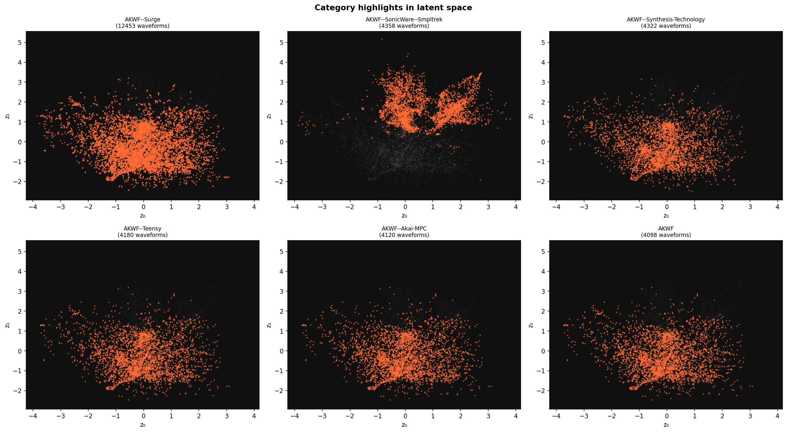
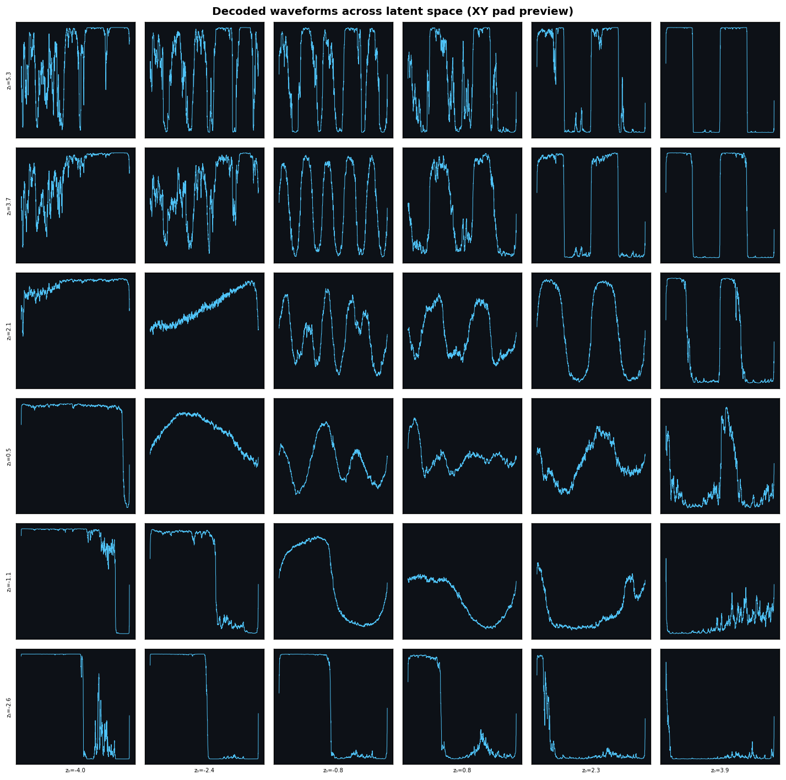

# Latent Synth

A neural wavetable synthesizer. A Variational Autoencoder (VAE) is trained on thousands of single-cycle waveforms, compressing them into a smooth 2D latent space. At runtime, an XY pad navigates that space in real time — every position decodes to a unique waveform, and moving through it morphs the timbre continuously.



*Each point is one of 45,000 AKWF waveforms, projected into the 2D latent space. The star-shaped structure reflects the diversity of the dataset — clusters correspond to different timbral families.*

---

## How it works

```
AKWF waveforms  →  VAE encoder  →  2D latent space  →  VAE decoder  →  waveform
                                          ↑
                                      XY pad
```

- The **encoder** compresses a 2048-sample waveform into a 2D point (z₀, z₁)
- The **decoder** is exported to ONNX and runs at runtime — no PyTorch needed
- The **oscillator** loops the decoded waveform at the target frequency (wavetable synthesis)
- KL divergence during training enforces smoothness, so nearby latent points sound similar

### Latent space navigation grid



*Each cell is a waveform decoded from a point on a regular grid. You can hear the morphing as you sweep the XY pad across the space.*

---

## Synth UI

Classic Macintosh-inspired interface built with tkinter:

- **XY Pad** — drag to navigate the latent space; shows z₀/z₁ coordinates and the name of the nearest AKWF waveform
- **Oscilloscope** — live audio display with zero-crossing trigger; shows decoded waveform shape when silent
- **Envelope** — ADSR amplitude envelope with log-scale sliders (1 ms – 8000 ms)
- **Filter** — resonant lowpass with envelope modulation amount
- **Motion** — LFO with four shapes, Z0/Z1 scan sliders, glide, and a Randomize button
- **Arpeggiator** — step arpeggiator (1–4 steps) with per-step latent positions, BPM/gate control, and up/down/up-down/random order
- **I/O** — master gain, MIDI input selector, audio output selector, keyboard piano toggle

### Motion panel

| Control | Behaviour |
|---------|-----------|
| **LFO: OFF/ON** | Toggles automatic latent cycling |
| **Circ** | Traces a circle around the center point |
| **X / Y** | Scans one axis sinusoidally, holds the other |
| **Walk** | Ornstein-Uhlenbeck random walk (mean-reverts to center) |
| **Rate** | 0.05 – 4 Hz |
| **Depth** | Radius/amplitude in latent units (0 – 4) |
| **Glide** | Portamento time (0 – 1000 ms) |
| **Z0 / Z1** | Direct axis control; sets LFO center when LFO is on |
| **Randomize** | Single-click = nearby jump (r ≤ 1.5); double-click = anywhere |

### Keyboard piano

Press **M** to toggle. When on:

| Key | Action |
|-----|--------|
| `A W S E D F T G Y H U J K O L` | Piano keys (white + black), one octave |
| `Z` / `X` | Octave down / up |
| `C` / `V` | Velocity −10 / +10 |

### MIDI CC Learn

Every controllable parameter has a **CC** button. Click it (turns yellow), wiggle a hardware knob — the button shows the bound CC number and flashes green. Click again to cancel. **CLEAR CC** in the I/O panel removes all assignments.

Assignable parameters: Latent X, Latent Y, Z0, Z1, Gain, Cutoff, Resonance, Env Amount, Attack, Decay, Sustain, Release, Glide, LFO Rate, LFO Depth.

CC assignments persist to `~/.latent_synth_cc.json` and are restored on next launch.

### Waveform name

Below the oscilloscope, the synth shows the nearest AKWF waveform to the current latent position (e.g. *Akai MPC / AKWF_1725*, *Synthesis Technology / AKWF_eorgan_0018*). This requires `export/latent_index.npz` — see build instructions below. Without it, a spectral descriptor is shown instead (*Warm · Rich*, etc.).

### Settings persistence

The selected MIDI input port is saved to `~/.latent_synth_settings.json` and restored on next launch.

---

## Quickstart (pre-trained model included)

```bash
git clone <repo-url>
cd latent-vst

python -m venv .venv
source .venv/bin/activate
pip install -r requirements.txt

python app/synth.py
```

The repo includes a pre-trained ONNX decoder (`export/decoder.onnx` + `export/decoder.onnx.data`), so you can run the synth immediately without training.

**MIDI:** Connect a MIDI controller and select it from the MIDI In dropdown. The synth responds to note-on/off velocity and any CC assignments you configure. Audio routes to whatever device you select in Audio Out — use a virtual cable (e.g. [BlackHole](https://existential.audio/blackhole/)) to send it into a DAW.

---

## Training from scratch

### 1. Download the dataset

```bash
git clone https://github.com/KristofferKarlAxelEkstrand/AKWF-FREE data/akwf
```

The AKWF-FREE dataset contains ~48,000 single-cycle WAV files across 40+ categories.

### 2. Train the VAE

```bash
python model/train.py --data data/akwf --epochs 200 --beta 0.001
```

Key flags:

| Flag | Default | Notes |
|------|---------|-------|
| `--epochs` | 100 | Total epochs to train (ceiling, not additional) |
| `--beta` | 1.0 | KL weight — keep low (0.001–0.01) to prevent posterior collapse |
| `--warmup` | 20 | Epochs to ramp β from 0 to target |
| `--batch-size` | 256 | Reduce if you run out of memory |
| `--resume` | — | Path to checkpoint to continue from |

Training logs are saved to `model/checkpoints/train_log.csv`. Best checkpoint (by validation loss) is saved to `model/checkpoints/best.pt`.

### 3. Visualize the latent space

```bash
MPLBACKEND=Agg python notebooks/visualize_latent.py \
  --checkpoint model/checkpoints/best.pt --grid
```

Saves scatter plot, density heatmap, category highlights, and a decode grid to `plots/`.

### 4. Export to ONNX

```bash
python export/export.py --checkpoint model/checkpoints/best.pt
```

Validates the ONNX output against PyTorch and benchmarks inference latency. Target: < 1 ms per waveform.

### 5. Build the latent index

```bash
python export/build_latent_index.py
```

Encodes all waveforms through the trained VAE encoder and saves their 2D coordinates to `export/latent_index.npz`. The synth uses this for nearest-neighbour waveform name lookup. Re-run after retraining.

### 6. Run the synth

```bash
python app/synth.py --model export/decoder.onnx
```

---

## Architecture

### VAE

```
Encoder
  Conv1d(1→64,   k=8, stride=4)  + BN + LeakyReLU   # 2048 → 512
  Conv1d(64→128, k=8, stride=4)  + BN + LeakyReLU   # 512  → 128
  Conv1d(128→256,k=8, stride=4)  + BN + LeakyReLU   # 128  → 32
  Conv1d(256→512,k=8, stride=4)  + BN + LeakyReLU   # 32   → 8
  Flatten → Linear → (μ, log σ²)                     # 8×512 → 2

Decoder  (runtime — exported to ONNX)
  Linear(2 → 4096)  + reshape to (512, 8)
  ConvTranspose1d(512→256, k=8, stride=4) + BN + LeakyReLU
  ConvTranspose1d(256→128, k=8, stride=4) + BN + LeakyReLU
  ConvTranspose1d(128→64,  k=8, stride=4) + BN + LeakyReLU
  ConvTranspose1d(64→1,    k=8, stride=4) + Tanh
  # output: (batch, 1, 2048) in [-1, 1]
```

~705K parameters total.

### Loss

```
L = MSE(recon, target) + β · KL(q(z|x) || N(0,I))
```

β = 0.001 worked well on the full AKWF dataset. Higher β produces smoother navigation at the cost of reconstruction fidelity.

### Audio engine

- Decoded waveform is looped as a single-cycle wavetable
- Phase increment: `WAVEFORM_LEN × freq / SAMPLE_RATE`
- Linear interpolation between samples for alias-free playback
- 512-sample blocks at 44100 Hz → ~11.6 ms latency
- Up to 8 voices with square-root gain scaling

---

## Project structure

```
.
├── app/
│   └── synth.py              # Standalone synth app (engine + UI)
├── data/
│   └── akwf/                 # AKWF dataset (not in repo — see above)
├── export/
│   ├── export.py             # ONNX export script
│   ├── build_latent_index.py # Build waveform name lookup index
│   ├── decoder.onnx          # Exported model graph
│   ├── decoder.onnx.data     # Model weights (1.3 MB)
│   └── latent_index.npz      # Latent coords for 45K waveforms (build once)
├── model/
│   ├── vae.py                # VAE architecture
│   ├── dataset.py            # AKWF dataset loader + cache
│   ├── train.py              # Training loop
│   └── checkpoints/
│       ├── best.pt           # Best checkpoint by val loss
│       └── train_log.csv     # Loss history
├── notebooks/
│   └── visualize_latent.py   # Latent space plots
├── plots/                    # Generated visualizations
└── CLAUDE.md                 # Project spec & working notes
```

---

## Dependencies

- Python 3.13
- PyTorch 2.10 + torchaudio
- soundfile (WAV loading — torchaudio 2.10 dropped old backends)
- onnx / onnxruntime / onnxscript
- sounddevice (audio output)
- pygame (MIDI input via PortMidi — avoids Python 3.13 GIL issues with rtmidi)
- scipy (biquad filter + KDTree for waveform name lookup)
- matplotlib (visualization only)

---

## Next Steps

Ideas for where to take this next, roughly in order of effort:

**Sound quality**
- Add a spectral loss term (FFT magnitude MSE) alongside the reconstruction loss — the current MSE-only loss treats all frequencies equally, which tends to blur high-frequency content
- Increase latent dim to 8–16 and learn a 2D projection for the XY pad (PCA or a small learned network), giving the model more expressive capacity while keeping the interface simple
- Train on a focused subset of AKWF categories (e.g. organ + strings only) for a more coherent, navigable space

**Sequencing**
- **Waypoint sequencer** — store 4–8 latent points, step through or interpolate between them on a clock or MIDI trigger; like a wavetable step sequencer for the XY pad
- Tempo-sync the LFO rate to MIDI clock

**Synth features**
- Preset save/load — serialize named latent positions to JSON
- MIDI program change to step through stored presets

**Distribution**
- Package as a VST3/AU plugin via [JUCE](https://juce.com/) or [iPlug2](https://iplug2.github.io/) with the ONNX runtime embedded
- Or wrap the Python app in a standalone `.app` bundle with PyInstaller

## Resources

- [AKWF Dataset](https://www.adventurekid.se/akwf/) — Adventure Kid Waveforms
- [β-VAE paper](https://openreview.net/forum?id=Sy2fzU9gl)
- [RBJ Audio EQ Cookbook](https://webaudio.github.io/Audio-EQ-Cookbook/audio-eq-cookbook.html) — filter coefficients
- [ONNX Runtime](https://onnxruntime.ai/docs/api/python/)
